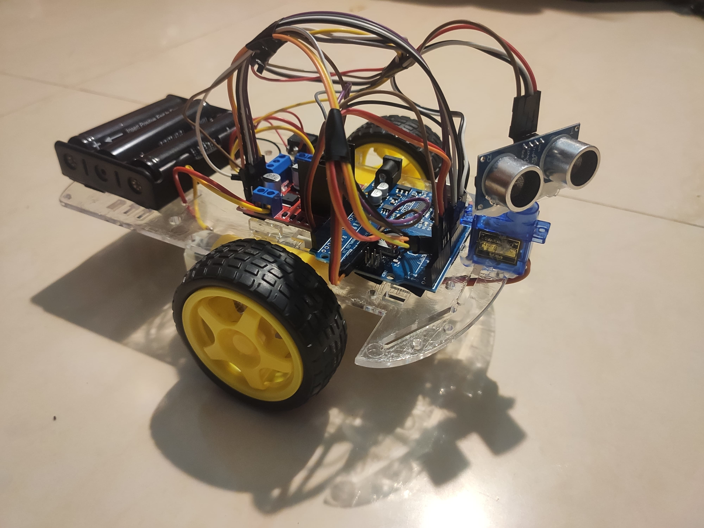

# ObstacleAvoidingCarWithoutSpeedError

* [About](#about)
* [Picture](#picture)
* [Diagram](#diagram)
---

## About

This repository contains code and diagram for ObstacleAvoidingCar using arduino without speed error.

## Picture

    

## Diagram

    

